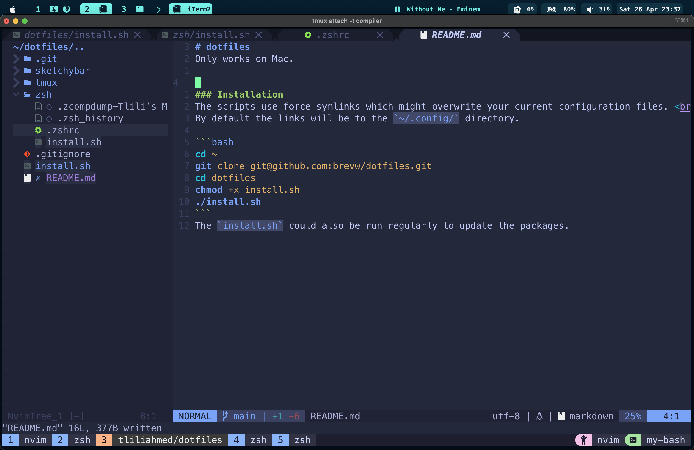

# dotfiles
Only works on Mac.

Expectations:


### Installation
The scripts use force symlinks which might overwrite your current configuration files. <br>
By default the links will be to the `~/.config/` directory.

```bash
cd ~
git clone git@github.com:brevw/dotfiles.git
cd dotfiles
chmod +x install.sh
./install.sh
```
The `install.sh` could also be run regularly to update the packages.

What will be installed is the following:
- brew
- git
- iterm2
- zsh (oh-my-zsh)
- tmux (plugins automatically installed)
- sketchybar
- nvim (will require opening nvim to install the packages)

